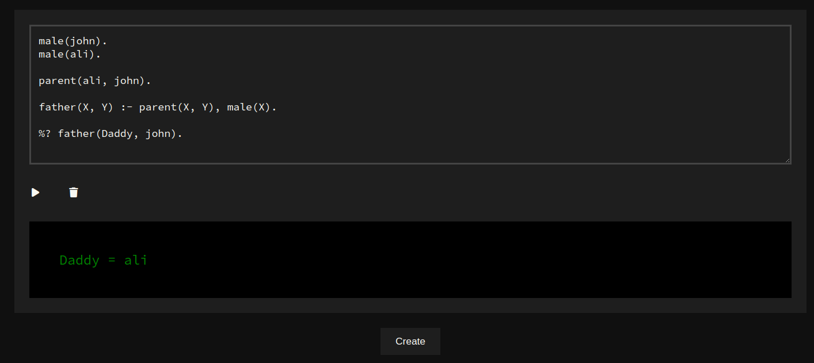

# Cool Prolog

A Web-BasedJupyter Notebook style Prolog Interpreter

## How to Use

Following is brief explaination about how to use Cool Prolog

### Open in Browser:

Start project and open in browser (after [installation](#how-to-install)):


### Create and Delete Cells:

- You can use __Create__ Button to create new cells.
- there is a __delete icon__ for deleting individual cells.


### Writing Facts, Rules and Queries

- You can write prolog code in input section of each cell.
- use %? to write queries
- % is used to write comments (without ? in it)



## How to Install

### 1. Unzip 
To install cool-prolog, download zip file [click here to download](./v1.1.1.zip). and then extract it.


### 2. Install Dependencies

Open terminal in `frontend/` and run command:

```bash
npm install
```

It will install all required frontend dependencies.

Then open terminal in `backend/` and run same command:

```bash
npm install
```

It will install all required backend dependencies.


### 3. Run serve

To run project, open `frontend/` in terminal and run:

```bash
npm start
```

then oen `backend/` in another terminal and run:

```bash
npm start
```


### 4. Open Project

Noe open following url in browser

[http://localhost:3000](http://localhost:3000)

And project is there with a __Create__ Button:

